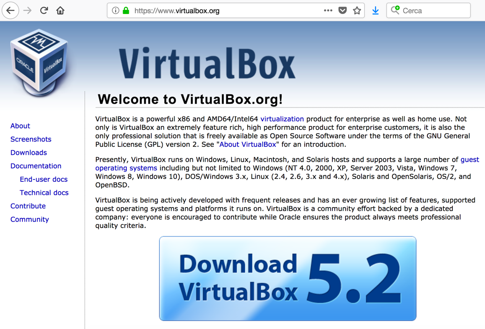
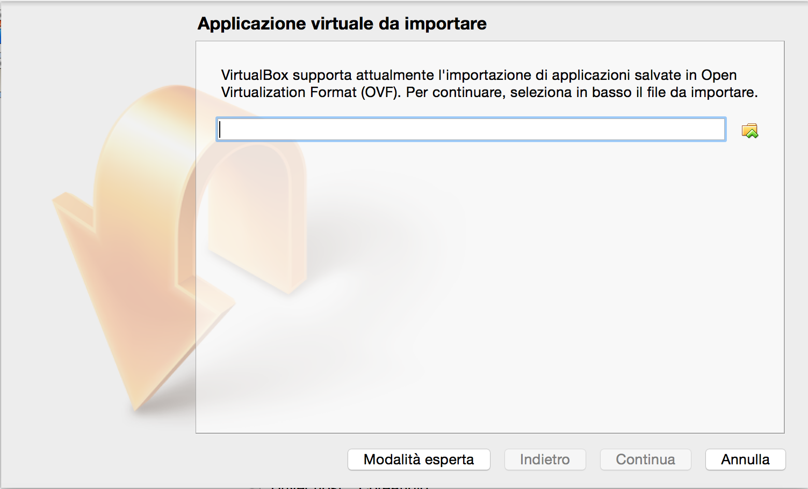
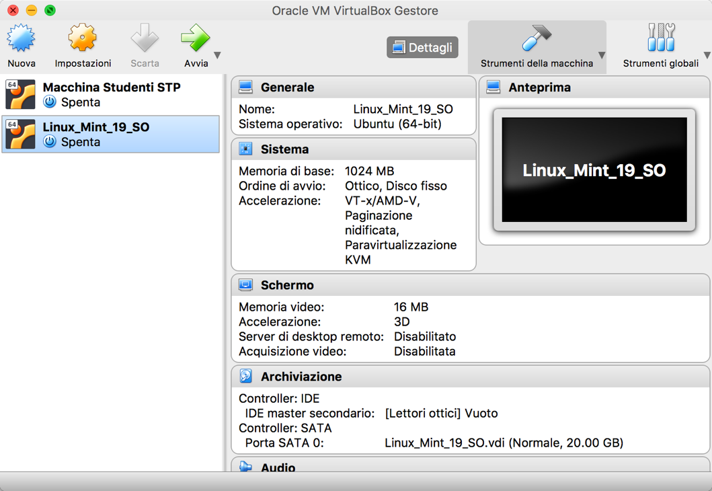
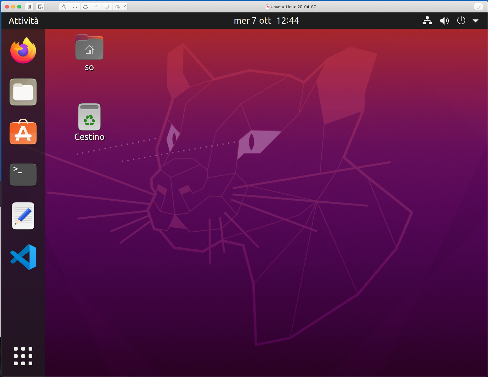
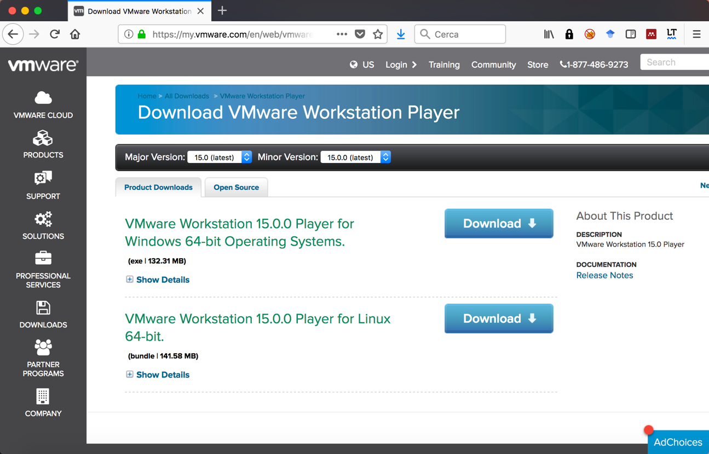
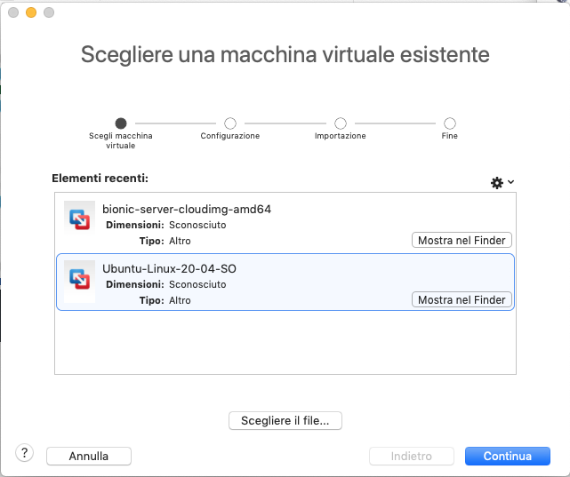
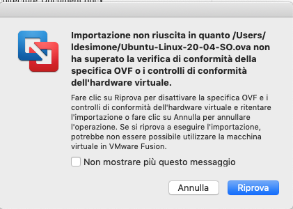
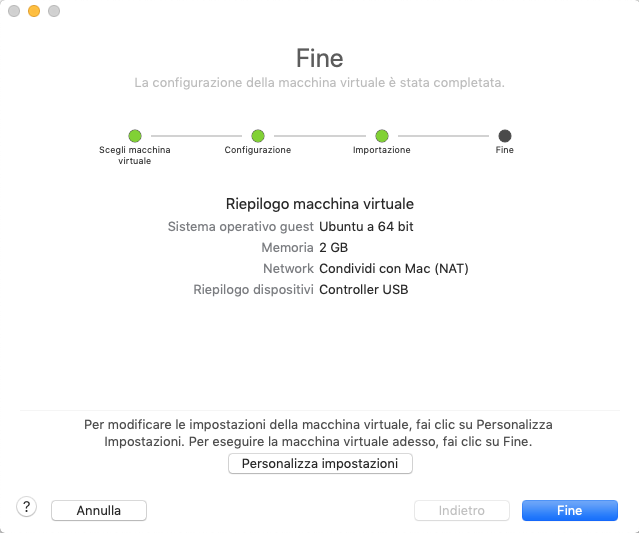

**Istruzioni per uso della macchina virtuale a supporto della parte esercitativa del corso di &quot;Sistemi Operativi&quot;**

Docenti: Domenico Cotroneo, Marcello Cinque, Roberto Natella

Ultimo aggiornamento: 07/10/2020

La macchina virtuale ospita il sistema operativo **Ubuntu 20.04 LTS** (una distribuzione leggera di **Linux** ), e contiene al suo interno i principali pacchetti software utili per il corso (shell, compilatore, debugger, etc.).

La macchina è contenuta in un file con estensione &#39; **.ova**&#39; da scaricare tramite il link OneDrive:

[https://communitystudentiunina-my.sharepoint.com/:u:/g/personal/roberto\_natella\_unina\_it/EbruKk\_SvlxBipH0\_cLe-eABcuFc2skO0t6EUAErq4cFOw?e=FkDLUZ](https://communitystudentiunina-my.sharepoint.com/:u:/g/personal/roberto_natella_unina_it/EbruKk_SvlxBipH0_cLe-eABcuFc2skO0t6EUAErq4cFOw?e=FkDLUZ)

Tale file è stato creato per mezzo del programma **Oracle**** VirtualBox**, che deve essere installato sulla macchina su cui si intende far girare la macchina virtuale. L&#39;applicativo VirtualBox è un gestore di macchine virtuali gratuito e facilmente installabile scaricando il programma di installazione dal sito internet della Oracle ([https://www.virtualbox.org/)](https://www.virtualbox.org/)).

La versione raccomandata di VirtualBox (su cui è stata creata la macchina virtuale) è la versione **5.2.18 (r124319)**.

Una volta installato VirtualBox è possibile **importare** la macchina virtuale, scegliendo &#39; **File -\&gt; Importa applicazione virtuale**&#39; come in figura:

Appare la seguente form dove inserire **il percorso del file &#39;.ova&#39;** con la macchina virtuale da caricare:

Cliccare qui per selezionare il file .ova

Cliccare l&#39;icona a destra del campo di testo (il bottone evidenziato in rosso nell&#39;immagine precedente), scegliere il file di estensione &#39;.ova&#39;.

Cliccando su **&#39;Continua&#39;** , dopo pochi minuti la macchina virtuale sarà importata in VirtualBox. La macchina virtuale apparirà a sinistra nella schermata principale di VirtualBox.

Per avviare la macchina virtuale, **cliccare sul nome della macchina virtuale** nell&#39;elenco a sinistra, e poi sul tasto &#39; **Avvia**&#39; in alto nella schermata. Prima di avviare la VM è possibile scegliere di personalizzare l&#39;hardware virtuale da utilizzare cliccando sul tasto &#39; **Impostazioni&#39;**. La raccomandazione è quella di avere almeno **2 CPU virtuali** e almeno **2Gb di memoria RAM**.

Dopo l&#39;avvio, apparirà una nuova finestra in cui eseguirà il sistema operativo Linux. Al termine dell&#39;avvio del sistema operativo, la macchina virtuale apparirà come segue:

In alternativa a VirtualBox, è possibile eseguire la macchina virtuale utilizzando il programma **VMware Workstation Player** (per Windows e Linux). Il programma è gratuitamente scaricabile da internet.

Per importare la macchina virtuale in VMware Workstation Player, si selezioni la voce **&quot;Importa...&quot;**.

Si aprirà una nuova finestra, in cui accorrerà scegliere il file **&quot;.ova&quot;** della macchina virtuale.

Nel caso dovesse apparire il seguente popup sulla &quot;verifica di conformità&quot;, selezionare l&#39;opzione **&quot;Riprova&quot;** per forzare l&#39;importazione.

L&#39;importazione della macchina virtuale potrebbe richiedere svariati minuti, dipendentemente dalla potenza della macchine fisica ospitante.

Come per VirtualBox, al termine dell&#39;operazione, è possibile scegliere di personalizzare l&#39;hardware virtuale da utilizzare per la VM importata oppure proseguire con i valori di default. La raccomandazione è quella di avere almeno 2 CPU virtuali e almeno 2Gb di memoria RAM.

La macchina virtuale dovrà apparire correttamente nella libreria di VMware Workstation Player.

**NOTE IMPORTANTI**

Per effettuare operazioni di amministrazione (ad esempio, installazione di pacchetti, il comando &quot;sudo&quot;, etc.), si utilizzi la password &#39; **so**&#39; (nome utente: &#39; **so**&#39;).